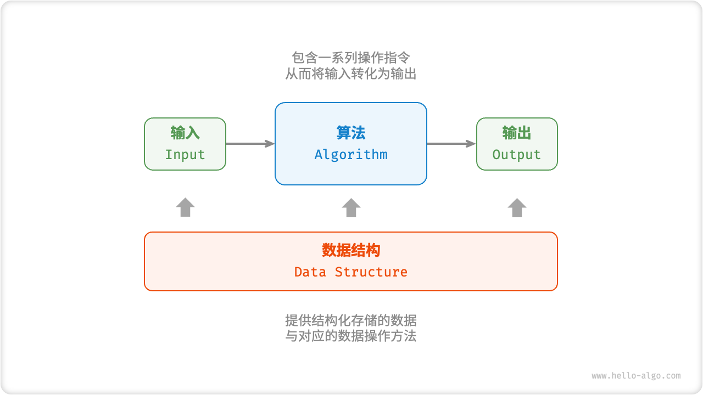
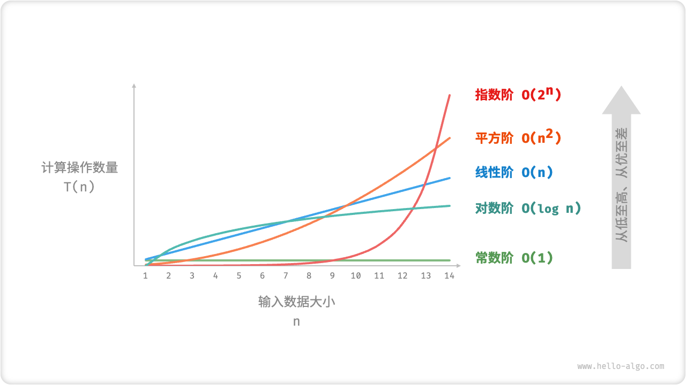

# LeetCodeLearner
Whether the experiment succeeds or fails, it should be an interesting learning experience.
Life is hard, learn from Afur.

**以下定义 摘自 hello-algo**
# 1.2.1.算法定义
`算法 Algorithm`是在有限时间内解决特定问题的一组指令或操作步骤。 算法具有以下特性：
* 问题是明确的，包含清晰的输入和输出定义
* 具有可行性，能够在有限步骤、时间和内存空间下完成
* 各步骤都有确定的含义，相同的输入和运行条件下，输出始终相同。

# 1.2.2.数据结构定义
`数据结构 Data Structure` 是计算机中组织和存储数据的方式。为了提高数据存储和操作性能，数据结构的设计目标包括：
* 空间占用尽量减少，节省计算机内存。
* 数据操作尽可能快速，涵盖数据访问、添加、删除、更新等。
* 提供简洁的数据表示和逻辑信息，以便使得算法高效运行。

数据结构设计是一个充满权衡的过程，这意味着要在某方面取得优势，往往需要在另一方面作出妥协。例如，链表相较于数组，在数据添加和删除操作上更叫便捷，但牺牲了数据访问速度；图相较于链表，提供了更丰富的逻辑信息，但需要占用更大的内存空间。

# 1.2.3. 数据结构与算法的关系
`数据结构`与`算法`高度相关且紧密结合，具体表现在：
* 数据结构是算法的基石。数据结构为算法提供了结构化存储的数据，以及用于操作数据的方法。
* 算法是数据结构发挥的舞台。数据结构本身仅存储数据信息，通过结合算法才能解决特定问题。
* 特定算法通常有对应最优的数据结构。算法通常可以基于不同的数据结构进行实现，但最终执行效率可能相差很大。






# 二分查找
在升序数组 nums 中寻找目标值 target，对于特定下标i，比较nums[i] 和 target 的大小：
* 如果 nums[i] == target, 则下标 i 即为要寻找的下标;
* 如果 nums[i] < target, 则 target 只可能在下标 i 右侧;
* 如果 nums[i] > target, 则 target 只可能在下标 i 左侧;

基于上述**事实**, 可以在有序数组中使用二分查找目标值.

二分查找的做法是,定义查找的范围[left, right], 初始查找范围是整个数组. 每次取查找范围的中点 mid, 比较 nums[mid]和 target的大小,如果相等则 mid 即为要寻找的下标,如果不相等则根据 nums[mid] 和 target 的大小关系将查找范围缩小一半.

由于每次查找都会将查找范围缩小一半,因此二分查找的时间复杂度是O(log n),其中n是数组的长度.

二分查找的条件是查找范围不为空,即left <= right. 如果 target在数组中, 二分查找可以保证找到target,返回target在数组中的下标.
如果target不在数组中,则当left > right时结束查找, 返回-1.
```java
class Solution {
    public int search(int[] nums, int target) {
        int left = 0, right = nums.length -1;
        while (left <= right) {
            int mid = (right - left) / 2 + left;
            int num = nums[mid];
            if (num == target) {
                return mid;
            } else if(num > target) {
                right = mid - 1;
            } else {
                left = mid + 1;
            }
        }
        return -1;
    }
}
```
